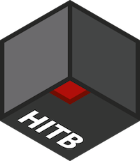
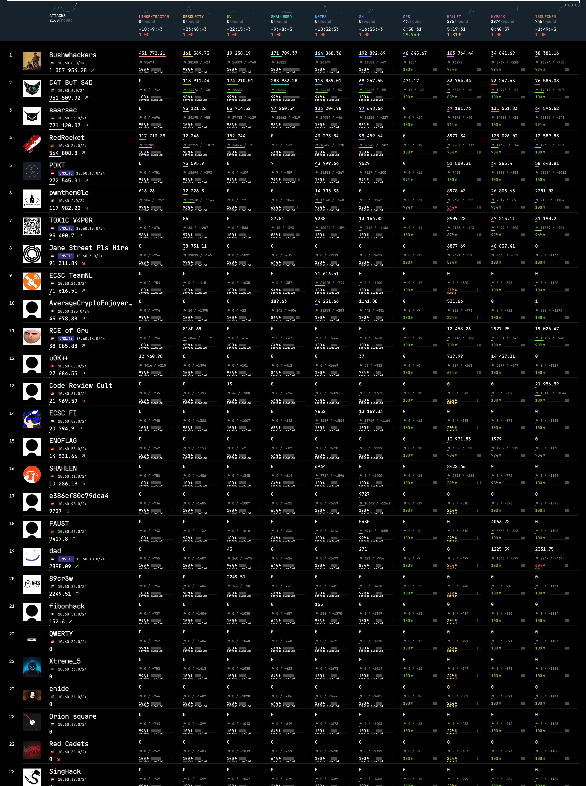

#  HITB SECCONF CTF 2022

HITB SECCONF CTF is an onsite + online international challenge in information security. Developed by Hackerdom team for HITB SECCONF in Singapore. HITB SECCONF CTF 2022 was held on August 25th–26th, 2022.

The contest is driven by almost classic rules for Attack-Defense [CTF](https://en.wikipedia.org/wiki/Capture_the_flag#Computer_security). Each team is given a set of vulnerable services.
Organizers regularly fill services with private information — the flags.
The goal of each team is to find vulnerabilities, fix them in their services and exploit them to get flags from other teams.

This year we have had some innovations:
· New scoring system (we will use it for the second time, first one was at [HITB PRO CTF 2021](https://github.com/HITB-CyberWeek/proctf-2021/))
· New flag format: `TEAM042_PNFP4DKBOV6BTYL9YFGBQ9006582ADCX`
· Non-playable teams
· Reverse proxies with per-team limits for services
· DNS names for all services (e.g. `example.team42.ctf.hitb.org`)

You can read details on official contest website: https://ctf.hackerdom.ru/hitb-ctf-singapore-2022/.

Official conferense website: https://conference.hitb.org/hitbsecconf2022sin/.

### This repository contains

* source of all services in folder [services/](services/)
* checkers for [checksystem](https://github.com/Hackerdom/checksystem) in folder [checkers/](checkers/)
* ... and config for it in [cs/](cs/).
* exploits for all services in folder [sploits/](sploits/)
* writeups with vulnerabilities and exploitation description for all services in folder [writeups/](writeups/)

Also, we bring to you some of our internal infrastructure magic:
* CI/CD for Digital Ocean's images services' packing and proxies deploying. See [vuln_images/](vuln_images/) and [.github/workflows/](.github/workflows).
* our CTF Cloud and VPN Infrastructure in [ctf-cloud/](ctf-cloud/).

Final scoreboard:

# First bloods

| **SERVICE**    | **TEAM**                 |
| -------------- | ------------------------ |
| linkextractor  | Bushwhackers             |
| obscurity      | C4T BuT S4D              |
| kv             | C4T BuT S4D              |
| smallword      | C4T BuT S4D              |
| n0tes          | Bushwhackers             |
| sh             | Bushwhackers             |
| crs            |                          |
| wallet         |                          |
| mypack         |                          |
| issuecker      |                          |

# Authors

This CTF is brought to you by these amazing guys:

* [Alexander Bersenev](https://github.com/alexbers) aka `bay`, the author of the service `obscurity`, also our Cloud and VPN master
* [Andrey Gein](https://github.com/andgein) aka `andgein`, out teamleader, DevOps and support for teams
* [Andrey Khozov](https://github.com/avkhozov) aka `and`, the author of the service `sh`, also our checksystem master
* [Artem Zinenko](https://github.com/ar7z1) aka `art`, the author of the service `n0tes`
* [Artur Khanov](https://github.com/awengar) aka `awengar`, the author of the service `mypack`
* [Dmitry Simonov](https://github.com/dimmo) aka `dimmo`, the author of the service `crs`
* [Dmitry Titarenko](https://github.com/dscheg) aka `dscheg`, the author of the service `smallword`
* [Konstantin Plotnikov](https://github.com/kostteg) aka `kost`, the author of the service `linkextractor`
* [Daniil Sharko](https://github.com/werelaxe) aka `werelaxe`, the author of the service `issuecker`
* [Nikolay Zhuravlev](https://github.com/znick) aka `znick`, the author of the service `kv`
* [Artem Deikov](https://github.com/hx0day) aka `hx0day`, the author of the service `wallet`

If you have any question about services write us an email to [info@hackerdom.ru](mailto:info@hackerdom.ru).

© 2022 [HackerDom](http://hackerdom.ru)
