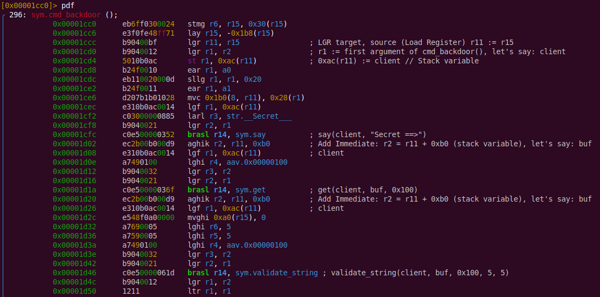
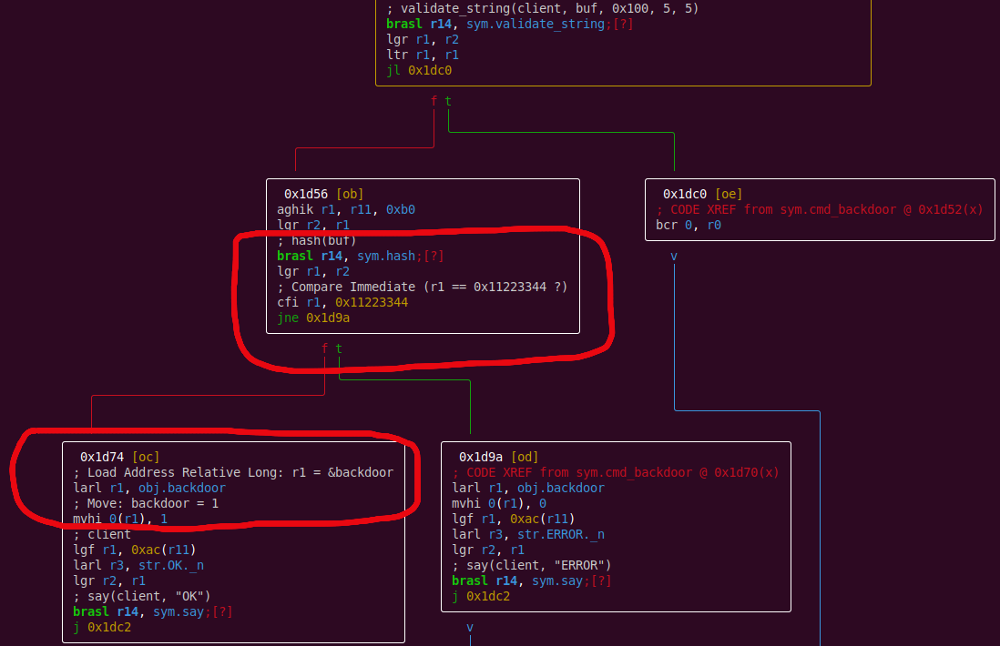
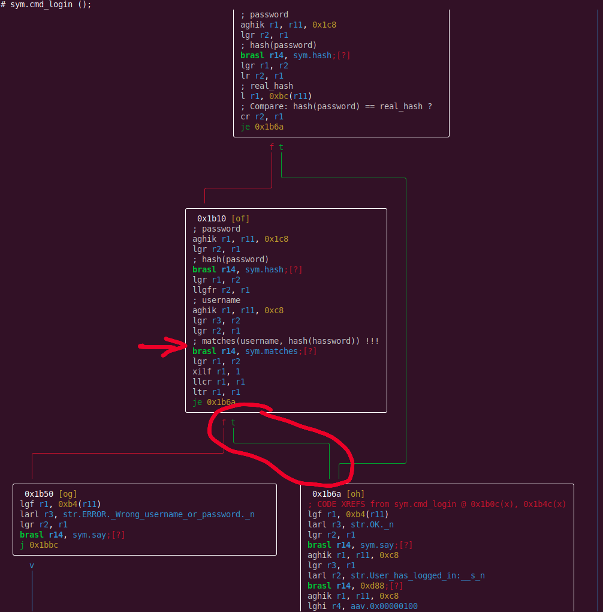
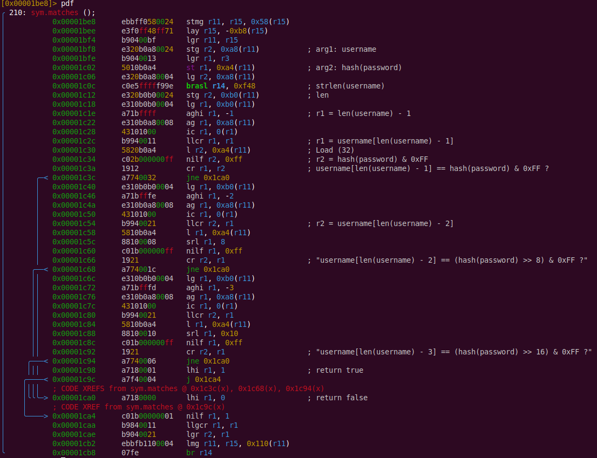

# CRS

## Description

CRS is a binary service for IBM System 390 architecture with TCP interface at port 4444.

```
=======================================================
Enterprise Systems CRS / GDS Welcome. Build 6.1672.1928
=======================================================

Attention: all activity is logged.

Command ==> help
Available commands:
  REGISTER
  LOGIN
  STORE
  RETRIEVE
  EXIT
```

Commands are case-insensitive.

* `REGISTER` and `LOGIN` accept 2 arguments: login and password.
* `STORE` is used to put private data for the user.
* `RETRIEVE` is used to get private data.

## Research using telnet

At first, we just connect with telnet and try different commands. We may notice 
that `RETRIEVE` command works before the first `STORE` and returns some hex value.

```
Command ==> login
  Username ==> demodemo
  Password ==> password
OK.

[demodemo] Command ==> retrieve
0xf5943865

[demodemo] Command ==> store
  Data ==> FLAGFLAG
OK.

[demodemo] Command ==> retrieve
FLAGFLAG
```

## Research using radare2

```
$ radare2 crs
[0x00001168]> aaa
[x] Analyze all flags starting with sym. and entry0 (aa)
[x] Analyze all functions arguments/locals
[x] Analyze function calls (aac)
[x] Analyze len bytes of instructions for references (aar)
[x] Finding and parsing C++ vtables (avrr)
[x] Finding xrefs in noncode section (e anal.in=io.maps.x)
[x] Analyze value pointers (aav)
[x] aav: 0x00000000-0x000033d0 in 0x0-0x33d0
[x] Emulate functions to find computed references (aaef)
[x] Type matching analysis for all functions (aaft)
[x] Propagate noreturn information (aanr)
[x] Use -AA or aaaa to perform additional experimental analysis.
```

Check strings, we will notice a suspicious "backdoor" string in the area with other commands:
```
[0x00001168]> fs strings; f
...
0x00002c86 5 str.help
0x00002c8c 9 str.register
0x00002c96 6 str.login
0x00002c9c 6 str.store
0x00002ca2 9 str.retrieve
0x00002cac 9 str.backdoor      <<<<
0x00002cb6 5 str.exit
...
```

Try this command, it really exists:
```
Command ==> backdoor
  Secret ==> qweqwe
ERROR. Too long.

Command ==> backdoor
  Secret ==> qweqw
ERROR.
```

Let's list functions, we see `cmd_*` functions that probably handle corresponding commands:
```
[0x00001168]> afl
...
0x00001f60   11 370          sym.cmd_retrieve
0x00001cc0    8 296          sym.cmd_backdoor
0x00001938   13 682          sym.cmd_login
0x00001de8   10 372          sym.cmd_store
0x000016e8   12 592          sym.cmd_register
0x00001640    1 166          sym.cmd_help
...
```

Learn from [s/390 & z/Architecture Register usage](https://www.kernel.org/doc/html/v5.3/s390/debugging390.html#s-390-z-architecture-register-usage):
```
* r2 	argument 0 / return value 0
* r3 	argument 1 / return value 1
* r4 	argument 2
* r5 	argument 3
* r6 	argument 4
  ...
* r11 	frame-pointer
  ...
* r14 	return-address
* r15 	stack-pointer
```

Opcodes meaning we can learn from:
* [360_Instructions](https://en.wikibooks.org/wiki/360_Assembly/360_Instructions) (wikibooks)
* [IBM z/Architecture - Principles of Operation](https://www.ibm.com/docs/en/SSQ2R2_15.0.0/com.ibm.tpf.toolkit.hlasm.doc/dz9zr006.pdf)

Also, radare2 itself can show short opcodes description, e.g.:
```
[0x00001cc0]> aod aghik
Add Immediate (6416)
```

Disassemble suspicious function `sym.cmd_backdoor` (comments are added manually):



Switch to visual mode (`V`), we'll see that user input `Secret ==>` is hashed, then hash value is checked
against `0x11223344`. If equals, variable `backdoor` is set to 1.



But, this is a wrong way, because `backdoor` variable is never used.

Let's see at `sym.cmd_login`.

Radare2 fails do find names for some functions, but `objdump -d crs | grep <ADDRESS>` can help us, e.g.:
```
# 0x00001a74      c0e5fffffada   brasl r14, 0x1028  ; WTF ?
root@ibm:~# objdump -d crs | grep 1a74
    1a74:	c0 e5 ff ff fa da 	brasl	%r14,1028 <strncpy@plt>

# 0x00001a7e      c0e5fffff9f5   brasl r14, 0xe68   ; WTF ?
root@ibm:~# objdump -d crs | grep 1a7e 
    1a7e:	c0 e5 ff ff f9 f5 	brasl	%r14,e68 <sleep@plt>

# 0x00001a94      c0e5fffff99a   brasl r14, 0xdc8   ; WTF ?
root@ibm:~# objdump -d crs | grep 1a94
    1a94:	c0 e5 ff ff f9 9a 	brasl	%r14,dc8 <fopen@plt>
```

After analyzing, we see that user is logged in two cases:
* `hash(password) == hash from user's file`,
* `matches(username, hash(password))` - this is the real backdoor!



<details>
  <summary>cmd_login with comments</summary>
<pre>
[0x00001938]> pdf
╭ 682: sym.cmd_login ();
│           0x00001938      eb6ff0300024   stmg r6, r15, 0x30(r15)
│           0x0000193e      e3f0fc30ff71   lay r15, -0x3d0(r15)
│           0x00001944      b90400bf       lgr r11, r15
│           0x00001948      b9040012       lgr r1, r2
│           0x0000194c      e330b0a80024   stg r3, 0xa8(r11)
│           0x00001952      5010b0b4       st r1, 0xb4(r11)            ; client
│           0x00001956      b24f0010       ear r1, a0
│           0x0000195a      eb110020000d   sllg r1, r1, 0x20
│           0x00001960      b24f0011       ear r1, a1
│           0x00001964      d207b3c81028   mvc 0x3c8(8, r11), 0x28(r1)
│           0x0000196a      e310b0b40014   lgf r1, 0xb4(r11)           ; client
│           0x00001970      c030000009dc   larl r3, str.__Username___
│           0x00001976      b9040021       lgr r2, r1
│           0x0000197a      c0e500000513   brasl r14, sym.say          ; say(client, "Username ==>")
│           0x00001980      ec2b02c800d9   aghik r2, r11, 0x2c8        ; buf
│           0x00001986      e310b0b40014   lgf r1, 0xb4(r11)           ; client
│           0x0000198c      a7490100       lghi r4, aav.0x00000100
│           0x00001990      b9040032       lgr r3, r2
│           0x00001994      b9040021       lgr r2, r1
│           0x00001998      c0e500000530   brasl r14, sym.get          ; get(client, buf, 0x100)
│           0x0000199e      ec2b02c800d9   aghik r2, r11, 0x2c8        ; buf
│           0x000019a4      e310b0b40014   lgf r1, 0xb4(r11)           ; client
│           0x000019aa      e548f0a00000   mvghi 0xa0(r15), 0
│           0x000019b0      a7690008       lghi r6, 8
│           0x000019b4      a7590003       lghi r5, 3
│           0x000019b8      a7490100       lghi r4, aav.0x00000100
│           0x000019bc      b9040032       lgr r3, r2
│           0x000019c0      b9040021       lgr r2, r1
│           0x000019c4      c0e5000007de   brasl r14, sym.validate_string ; validate_string(client, buf, 0x100, 3, 8)
│           0x000019ca      b9040012       lgr r1, r2
│           0x000019ce      1211           ltr r1, r1
│       ╭─< 0x000019d0      a74400f2       jl 0x1bb4
│       │   0x000019d4      ec2b02c800d9   aghik r2, r11, 0x2c8        ; buf
│       │   0x000019da      ec1b00c800d9   aghik r1, r11, 0xc8         ; username
│       │   0x000019e0      a7490100       lghi r4, aav.0x00000100
│       │   0x000019e4      b9040032       lgr r3, r2
│       │   0x000019e8      b9040021       lgr r2, r1
│       │   0x000019ec      c0e5fffffb1e   brasl r14, 0x1028           ; strncpy(username, buf, 0x100)
│       │   0x000019f2      e310b0b40014   lgf r1, 0xb4(r11)           ; client
│       │   0x000019f8      c030000009b6   larl r3, str.__Password___
│       │   0x000019fe      b9040021       lgr r2, r1
│       │   0x00001a02      c0e5000004cf   brasl r14, sym.say          ; say(client, "Password ==>")
│       │   0x00001a08      ec2b02c800d9   aghik r2, r11, 0x2c8        ; buf
│       │   0x00001a0e      e310b0b40014   lgf r1, 0xb4(r11)           ; client
│       │   0x00001a14      a7490100       lghi r4, aav.0x00000100
│       │   0x00001a18      b9040032       lgr r3, r2
│       │   0x00001a1c      b9040021       lgr r2, r1
│       │   0x00001a20      c0e5000004ec   brasl r14, sym.get          ; get(client, buf, 0x100)
│       │   0x00001a26      ec2b02c800d9   aghik r2, r11, 0x2c8        ; buf
│       │   0x00001a2c      e310b0b40014   lgf r1, 0xb4(r11)           ; client
│       │   0x00001a32      e548f0a00000   mvghi 0xa0(r15), 0
│       │   0x00001a38      a7690014       lghi r6, 0x14
│       │   0x00001a3c      a7590006       lghi r5, 6
│       │   0x00001a40      a7490100       lghi r4, aav.0x00000100
│       │   0x00001a44      b9040032       lgr r3, r2
│       │   0x00001a48      b9040021       lgr r2, r1
│       │   0x00001a4c      c0e50000079a   brasl r14, sym.validate_string ; validate_string(client, buf, 0x100, 6, 0x14)
│       │   0x00001a52      b9040012       lgr r1, r2
│       │   0x00001a56      1211           ltr r1, r1
│      ╭──< 0x00001a58      a74400b1       jl 0x1bba
│      ││   0x00001a5c      ec2b02c800d9   aghik r2, r11, 0x2c8        ; buf
│      ││   0x00001a62      ec1b01c800d9   aghik r1, r11, 0x1c8        ; password
│      ││   0x00001a68      a7490100       lghi r4, aav.0x00000100
│      ││   0x00001a6c      b9040032       lgr r3, r2
│      ││   0x00001a70      b9040021       lgr r2, r1
│      ││   0x00001a74      c0e5fffffada   brasl r14, 0x1028           ; strncpy(password, buf, 0x100)
│      ││   0x00001a7a      a7290002       lghi r2, 2
│      ││   0x00001a7e      c0e5fffff9f5   brasl r14, 0xe68            ; sleep(2)
│      ││   0x00001a84      ec1b00c800d9   aghik r1, r11, 0xc8         ; username
│      ││   0x00001a8a      c03000000999   larl r3, 0x2dbc             ; 'ps @0x2dbc' gives us: "r"
│      ││   0x00001a90      b9040021       lgr r2, r1
│      ││   0x00001a94      c0e5fffff99a   brasl r14, 0xdc8            ; fopen(username, "r")
│      ││   0x00001a9a      e320b0c00024   stg r2, 0xc0(r11)           ; file
│      ││   0x00001aa0      e310b0c00004   lg r1, 0xc0(r11)
│      ││   0x00001aa6      b9020011       ltgr r1, r1
│     ╭───< 0x00001aaa      a774000f       jne 0x1ac8
│     │││   0x00001aae      e310b0b40014   lgf r1, 0xb4(r11)
│     │││   0x00001ab4      c03000000985   larl r3, str.ERROR._Wrong_username_or_password._n
│     │││   0x00001aba      b9040021       lgr r2, r1
│     │││   0x00001abe      c0e500000471   brasl r14, sym.say
│    ╭────< 0x00001ac4      a7f4007c       j 0x1bbc
│    ││││   ; CODE XREF from sym.cmd_login @ 0x1aaa(x)
│    │╰───> 0x00001ac8      ec1b00bc00d9   aghik r1, r11, 0xbc         ; real_hash
│    │ ││   0x00001ace      b9040041       lgr r4, r1
│    │ ││   0x00001ad2      c03000000960   larl r3, str.0x_08x_n
│    │ ││   0x00001ad8      e320b0c00004   lg r2, 0xc0(r11)            ; file
│    │ ││   0x00001ade      c0e5fffff965   brasl r14, 0xda8            ; fscanf(file, "0x%08x", real_hash)
│    │ ││   0x00001ae4      e320b0c00004   lg r2, 0xc0(r11)
│    │ ││   0x00001aea      c0e5fffffaef   brasl r14, 0x10c8           ; fclose(file)
│    │ ││   0x00001af0      ec1b01c800d9   aghik r1, r11, 0x1c8        ; password
│    │ ││   0x00001af6      b9040021       lgr r2, r1
│    │ ││   0x00001afa      c0e50000052f   brasl r14, sym.hash         ; hash(password)
│    │ ││   0x00001b00      b9040012       lgr r1, r2
│    │ ││   0x00001b04      1821           lr r2, r1
│    │ ││   0x00001b06      5810b0bc       l r1, 0xbc(r11)             ; real_hash
│    │ ││   0x00001b0a      1921           cr r2, r1                   ; Compare: hash(password) == real_hash ?
│    │╭───< 0x00001b0c      a784002f       je 0x1b6a
│    ││││   0x00001b10      ec1b01c800d9   aghik r1, r11, 0x1c8        ; password
│    ││││   0x00001b16      b9040021       lgr r2, r1
│    ││││   0x00001b1a      c0e50000051f   brasl r14, sym.hash         ; hash(password)
│    ││││   0x00001b20      b9040012       lgr r1, r2
│    ││││   0x00001b24      b9160021       llgfr r2, r1
│    ││││   0x00001b28      ec1b00c800d9   aghik r1, r11, 0xc8         ; username
│    ││││   0x00001b2e      b9040032       lgr r3, r2
│    ││││   0x00001b32      b9040021       lgr r2, r1
│    ││││   0x00001b36      c0e500000059   brasl r14, sym.matches      ; matches(username, hash(hassword)) !!!
│    ││││   0x00001b3c      b9040012       lgr r1, r2
│    ││││   0x00001b40      c01700000001   xilf r1, 1
│    ││││   0x00001b46      b9940011       llcr r1, r1
│    ││││   0x00001b4a      1211           ltr r1, r1
│   ╭─────< 0x00001b4c      a784000f       je 0x1b6a
│   │││││   0x00001b50      e310b0b40014   lgf r1, 0xb4(r11)
│   │││││   0x00001b56      c03000000934   larl r3, str.ERROR._Wrong_username_or_password._n
│   │││││   0x00001b5c      b9040021       lgr r2, r1
│   │││││   0x00001b60      c0e500000420   brasl r14, sym.say
│  ╭──────< 0x00001b66      a7f4002b       j 0x1bbc
│  ││││││   ; CODE XREFS from sym.cmd_login @ 0x1b0c(x), 0x1b4c(x)
│  │╰─╰───> 0x00001b6a      e310b0b40014   lgf r1, 0xb4(r11)
│  │ │ ││   0x00001b70      c03000000915   larl r3, str.OK._n
│  │ │ ││   0x00001b76      b9040021       lgr r2, r1
│  │ │ ││   0x00001b7a      c0e500000413   brasl r14, sym.say
│  │ │ ││   0x00001b80      ec1b00c800d9   aghik r1, r11, 0xc8
│  │ │ ││   0x00001b86      b9040031       lgr r3, r1
│  │ │ ││   0x00001b8a      c0200000092c   larl r2, str.User_has_logged_in:__s_n
│  │ │ ││   0x00001b90      c0e5fffff8fc   brasl r14, 0xd88
│  │ │ ││   0x00001b96      ec1b00c800d9   aghik r1, r11, 0xc8
│  │ │ ││   0x00001b9c      a7490100       lghi r4, aav.0x00000100
│  │ │ ││   0x00001ba0      b9040031       lgr r3, r1
│  │ │ ││   0x00001ba4      e320b0a80004   lg r2, 0xa8(r11)
│  │ │ ││   0x00001baa      c0e5fffffa3f   brasl r14, 0x1028
│  │ │╭───< 0x00001bb0      a7f40006       j 0x1bbc
│  │ ││││   ; CODE XREF from sym.cmd_login @ 0x19d0(x)
│  │ │││╰─> 0x00001bb4      0700           bcr 0, r0
│  │ │││╭─< 0x00001bb6      a7f40003       j 0x1bbc
│  │ ││││   ; CODE XREF from sym.cmd_login @ 0x1a58(x)
│  │ ││╰──> 0x00001bba      0700           bcr 0, r0
│  │ ││ │   ; CODE XREFS from sym.cmd_login @ 0x1ac4(x), 0x1b66(x), 0x1bb0(x), 0x1bb6(x)
│  ╰─╰╰─╰─> 0x00001bbc      b24f0010       ear r1, a0
│           0x00001bc0      eb110020000d   sllg r1, r1, 0x20
│           0x00001bc6      b24f0011       ear r1, a1
│           0x00001bca      d507b3c81028   clc 0x3c8(8, r11), 0x28(r1)
│       ╭─< 0x00001bd0      a7840005       je 0x1bda
│       │   0x00001bd4      c0e5fffff95a   brasl r14, 0xe88
│       │   ; CODE XREF from sym.cmd_login @ 0x1bd0(x)
│       ╰─> 0x00001bda      eb6fb4000004   lmg r6, r15, aav.aav.0x00000400)
╰           0x00001be0      07fe           br r14
</pre>
</details>

Let's find out what `sym.matches` function does!


I.e., equivalent C code is:
```
bool matches(char *user, unsigned int hash) {
    unsigned long len = strlen(user);
    return user[len-1] == (hash & 0xFF) &&
            user[len-2] == ((hash >> 8) & 0xFF) &&
            user[len-3] == ((hash >> 16) & 0xFF);
}
```

So, to login successfully as any (public known, from the checksystem API, as flag ID) 
username, we need to find `password` with 3 octets of hash matching last 3 chars of username!

Now, we have two options:
* reverse engineer hash function (complicated), rewrite in C, and write a bruteforcer tool,
* convert `crs` binary to a shared library, and call it from external binary to brute force (preferred way).

In the second approach, the [lief library](https://lief-project.github.io/doc/latest/tutorials/08_elf_bin2lib.html) 
can help us.

Then, we run this bruteforce binary on a given s390 VM, wait a bit, and get such a table:
```
000 : a6hp39
001 : aayvm9
002 : a4wizu
003 : aeeecb
...
zzx : bg30vi
zzy : adoqur
zzz : ahs194
```

Now, for each login (e.g., `xxyzzy`), we can quickly get matching password (e.g., `adoqur`).
