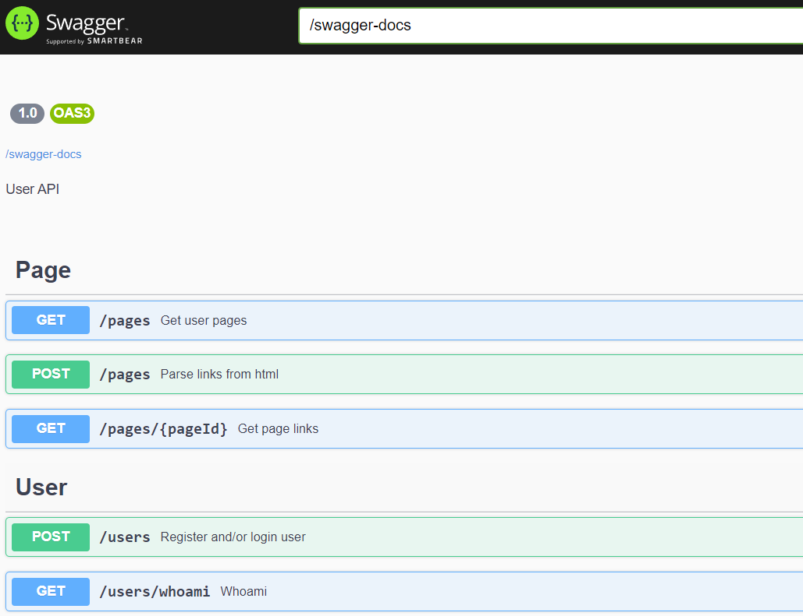

# LinkExtractor

## Description
LinkExtractor is a service for parsing distinct urls from the provided webpages.
The service is written in Java and uses Javalin web framework. Service provides OpenApi UI.



Service has 2 controllers:

### User

It has endpoints to register/login user and to check current logged in user. 

### Page

Endpoints for submitting webpage with url/content to parse, and get back distinct parsed urls.

## Vuln class

Java Deserialization Vulnerability with leaking information through the DNS resolving of Java's URLs objects.
It's inspired by the ysoserial's [URLDNS](https://github.com/frohoff/ysoserial/blob/master/src/main/java/ysoserial/payloads/URLDNS.java) payload.

## Exploitation


### First try

User authentication cookies contain Java-serialized service's `User` objects.
In theory, hacker can pass any Java-serialized object instead.
The aforementioned [ysoserial](https://github.com/frohoff/ysoserial) tool contains a lot of ready payloads for different popular Java libraries which are subject to Java Deserialization vulnerability.
Most such payloads even provide RCE.

To protect from such unintended vulnerabilities this service sets global filter,
which permits only classes from [ctf.linkextractor.entities](../../services/linkextractor/src/main/java/ctf/linkextractor/entities) package which contains service's POJO models used to store data.      
```java
ObjectInputFilter.Config.setSerialFilter(new EntitiesObjectInputFilter());

...

public class EntitiesObjectInputFilter implements ObjectInputFilter {
    public Status checkInput(FilterInfo filterInfo) {
        Class<?> clazz = filterInfo.serialClass();
        if (clazz != null && filterInfo.depth() == 1) {
            String clazzName = clazz.getName();
            return clazzName.startsWith("ctf.linkextractor.entities.") ? Status.ALLOWED : Status.REJECTED;
        }
        return Status.UNDECIDED;
    }
}

```
### Woriking way

So the only classes available for the hacker when exploiting Java Deserialization vuln are: `Link`, `Page` and `User` from the `ctf.linkextractor.entities` package  and also classes used inside them, like `HashSet<Link>`.

Flags are stored in page's url, like `https://TEAMXXX_0123456789ABCDEF0123456789ABCDEF.linkextractor.ctf.hitb.org` which are stored inside the Page entity. 
```java
public class Page implements Serializable {
    private int id;
    private String user;
    private String url;

    public HashSet<Link> links;
}
```

Service parses links from the provided page text and stores them in the Link entity, which references the Page by `pageId` 
```java
public class Link implements Serializable {
    private int id;
    private int pageId;
    private String parsedUrl;
}
```

When answering the `/pages/{pageId}` endpoint, service returns only distinct links.
So methods `hashCode()` and `equals` are overriden in Link class and both first resolve relative links to the Page's base url.

```java
private URL resolveUrl() {
    Page page = DB.singletone.getPageById(pageId);
    ...
    return toAbsoluteUrl(page.getUrl(), parsedUrl);
}
```


Resolution algorithm contains a **bug**: if link is relative and doesn't start from `..` or `/` - it is simply concatenated to the page's base url. See last line here:
```java
private URL toAbsoluteUrl(String page_url, String link_url) throws MalformedURLException {
    if (link_url.contains("://"))
        return new URL(link_url);
    if (link_url.startsWith("//"))
        return new URL(new URL(page_url).getProtocol() + ":" + link_url);
    ...
    return new URL(page_url + link_url);
}
```

URL's equality checking can be triggered by putting them inside the HashSet<Link>.

There is a well-known gadget in ysoserial's [URLDNS](https://github.com/frohoff/ysoserial/blob/master/src/main/java/ysoserial/payloads/URLDNS.java) payload, which is based on the fact that Java's `URL` class **resolves DNS record** of the url so that urls are comared by thei ip-addresses.
If hacker controls the DNS server, he can see all the requests. There exist publicly available services which provide you the DNS-zone and show the DNS-requests, like this one: https://requestbin.net/

So to exploit service and get FLAG (knowing `pageId` of the target page from the checksystem API)
hacker has to create the Link with the relative url `.<some>.<controlled>.<by>.<hacker>.<domain>` referencing the target Page by pageId, and then put it to HashSet with some other similar Link.
This HashSet of Links should be stored in the Page object in it's `public HashSet<Link> links` field.

If hacker serializes this crafted Page object and passes it in a user auth cookie to the service, it will be deserialized by the service and the following chain will be triggered:

```
Page deserialization -> HashSet<Link> deserialization -> hashCode(resolveUrl()) => DNS resolution and leaking of the FLAG
```
 
You can see full exploit here: [EXPLOIT](../../sploits/linkextractor/src/main/java/ctf/linkextractor/Program.java)
