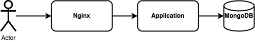
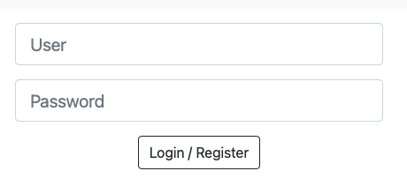
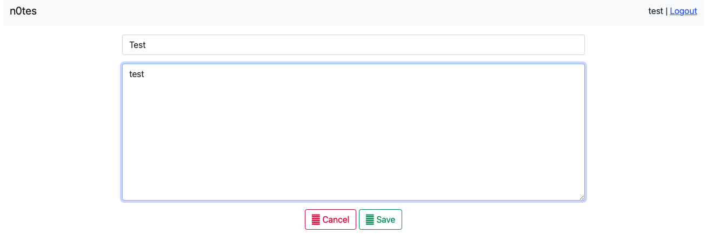

# n0tes

## Service Description
`n0tes` is a service to create/edit notes. It is written in C# and uses MongoDB as a data storage and Nginx as a reverse proxy:



The service has two interfaces for communication - user and admin.

The user interface allows to:

1. Register a new user

   

2. Create a note
   

The admin interface allows exporting all the notes in JSON:
```
GET /export HTTP/1.1
Host: admin.n0tes.ctf.hitb.org
...

HTTP/1.1 200 OK
Content-Type: application/json; charset=utf-8
Transfer-Encoding: chunked
Connection: keep-alive
Server: nginx/1.23.1
Date: Thu, 25 Aug 2022 18:26:54 GMT

[{"id":"60618a26-e36f-4c20-b0f2-e8c9755cc342","user":"test","title":"Test title","content":"Test note","createdUtcDate":"2022-08-25T18:12:34.624Z","updatedUtcDate":"2022-08-25T18:12:34.624Z"}]
```

The access to the admin endpoint is protected using client certificate authentication. This protection is implemented in Nginx for the virtual host `admin.n0tes.ctf.hitb.org`:
```
server {
    ...
    server_name  admin.n0tes.ctf.hitb.org;
    ...
    ssl_client_certificate /etc/ssl/certs/n0tes-admin.crt;
    ssl_verify_client optional_no_ca;

    location / {
        if ($ssl_client_verify != SUCCESS) {
            return 403;
        }

        proxy_pass http://app:5000;
        ...
    }
}
```

The application selects the right endpoint (user or admin) based on the `Host` header from Nginx:
```
app.UseEndpoints(endpoints =>
{
    endpoints.MapControllerRoute("admin", "{controller=Admin}/{action=Export}").RequireHost(Constants.AdminHost);
    endpoints.MapControllerRoute("default", "{controller=Notes}/{action=Index}");
});
```

## Vulnerability Description
To steal the flags, teams should somehow bypass the client certificate authentication in Nginx.

This can be done by exploiting the difference in handling the `Host` header in the application and Nginx.

According to [Microsoft documentation](https://docs.microsoft.com/en-us/dotnet/api/microsoft.aspnetcore.http.hoststring?view=aspnetcore-6.0), .NET decodes the [Punycode-encoded](https://en.wikipedia.org/wiki/Punycode) `Host` header and uses its decoded value for comparison. On the contrary, the Nginx does not decode Punycode-encoded `Host` and uses it as is.

Using this distinction, an attacker could pass the Punycode-encoded `Host` header (`xn--admin-.n0tes.ctf.hitb.org`, for example), hit the default virtual host in Nginx, and bypass the authentication.

## Exploit

Twittable PoC:
```
curl -ks --resolve admin.n0tes.ctf.hitb.org:443:<TEAM IP> https://admin.n0tes.ctf.hitb.org/export -H "Host: xn--admin-.n0tes.ctf.hitb.org"
```

You can find a functional exploit at [/sploits/n0tes/sploit.sh](../../sploits/n0tes/sploit.sh).
