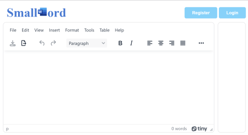

# SmallWord

## Description
SmallWord is a service for editing documents and exporting it to DOCX. The service is written in C# and uses files as a persistent storage.



List of available endpoints:
* /login — login by password;
* /register — register new user, profile is serialized to disk using protobuf;
* /file/FILE_ID[?export=true] — get/put file content, export file as DOCX;
* /files — list of files saved by user.

## Vuln [tldr]

Including user profile into DOCX as an image through a path traversal in open source Open-XML-PowerTools library, unsecure password peppering leading to master key leakage.

## Exploitation

There are some "hints" for the service in a code:
* Master key [XOR'ing](../../../../blob/583540b5e7421beaeef6648fe3e21dd54c8d407e/services/smallword/src/UserProfile.cs#L148) (as a pepper) with password hash => if someone get the possibility to connect the file to the DOCX, he will be able to steal the master key;
* Setting a some [base URI](../../../../blob/8d132cb4b86c69ac8bf557f4b3c62b03c43ce98a/services/smallword/src/Converter.cs#L13) for images, BTW there is no way to put such images;
* [System.Drawing.Common](../../../../blob/583540b5e7421beaeef6648fe3e21dd54c8d407e/services/smallword/src/smallword.csproj#L13) in deps, checker adds image on each PUT;
* Weird large number of [useless fields](../../../../blob/583540b5e7421beaeef6648fe3e21dd54c8d407e/services/smallword/src/UserProfile.cs#L12) in user profile.

Let's go in order

### Password hashing

Here is a function for hashing a password:
```cs
private static byte[] HashPassword(string password, byte[] salt, byte[] pepper)
    => KeyDerivation.Pbkdf2(password, salt, KeyDerivationPrf.HMACSHA256, iterationCount: 7, 256 / 8)
        .Select((b, i) => (byte)(b ^ pepper[i % pepper.Length]))
        .ToArray();
```

In cryptography, a pepper is a secret added to an input such as a password during hashing with a cryptographic hash function. The hash and salt are usually stored in a database, but a pepper must be stored separately to prevent it from being obtained by the attacker in case of a database breach.
The implementation of the pepper in code snippet above is absolutely insecure because an attacker can easily recover the pepper value by XOR'ing stealed password hash value with the password hash calculated by a known algorithm.

The service uses a master key as a pepper, so an attacker who steals a user profile can easily generate authentication cookies.

### Stealing profile

The most dangerous functionality in the service is the HTML-to-DOCX conversion. The input HTML in the service is parsed as XML, the DOCX is also archived XML, and DOCX can include various types of nested objects.
So it seems quite logical to check the service for XXE, SSRF and including files from disk during conversion.

XML reading [settings](../../../../blob/8d132cb4b86c69ac8bf557f4b3c62b03c43ce98a/services/smallword/src/Converter.cs#L36) are quite strict, not allowing us to achieve XXE. It also seems unlikely that the XXE vuln is present in the library when converting from HTML to DOCX.
```cs
XmlResolver = null,
DtdProcessing = DtdProcessing.Prohibit,
IgnoreProcessingInstructions = true
```

What about embedded objects? The most common embedded object is an image, and [here is a code](https://github.com/dscheg/Open-Xml-PowerTools/blob/aa45d25c0afd8695b8bd7088ee949349ace10e41/OpenXmlPowerTools/HtmlToWmlConverterCore.cs#L2299) in a linked open source Open-XML-PowerTools library:
```cs
if (srcAttribute.StartsWith("data:"))
{ /* ... */ }
else
{
    try
    {
        bmp = new Bitmap(settings.BaseUriForImages + "/" + srcAttribute);
    }
    catch (ArgumentException) { return null; }
    catch (NotSupportedException) { return null; }
    /* ... */
}
```

_Also note that searching for the word `file` in a converter's code gives us only one interesting match - in the image inclusion code._

This code is vulnerable to a path traversal, and that's why this piece of HTML
```html

```
lead us to inclusion a user profile as an image. The problem is this profile must be a correct image! So the last part

### Creating protobufed Bitmap

We need to generate such user profile which can be loaded as a correct image by `Bitmap` class, which uses `System.Drawing.Common` library, which [uses](https://docs.microsoft.com/en-us/dotnet/core/compatibility/core-libraries/6.0/system-drawing-common-windows-only#reason-for-change) `libgdiplus` as a cross-platform backend.
`GDI+` and its implementation `libgdiplus` [supports](https://github.com/MicrosoftDocs/win32/blob/docs/desktop-src/gdiplus/-gdiplus-using-image-encoders-and-decoders-use.md) this list of formats: BMP, GIF, JPEG, PNG, TIFF, WMF, EMF, ICON.
WMF and EMF seems too complicated file formats to use in such exploitation. ICON file must start with two 0x00, which seems impossible with protobuf serialization.

In the list of the rest formats BMP is the simplest, so try it. Here is a [BMP header](https://en.wikipedia.org/wiki/BMP_file_format#Bitmap_file_header) struct:
```cs
struct Bmp
{
    // BMP file header
    ushort Magic = 0x4D42;      // BM in ASCII (little-endian)
    uint ByteLength;            // The size of the BMP file in bytes
    ushort Reserved1 = 0;       // Reserved; actual value depends on the application that creates the image
    ushort Reserved2 = 0;       // Reserved; actual value depends on the application that creates the image
    uint DataOffset = 0x1A;     // The offset of the byte where the bitmap image data (pixel array) can be found

    // DIB header
    uint HeaderSize = 0x0C;
    ushort Width;
    ushort Height;
    ushort ColorPlanes = 0x01;  // The number of color planes (must be 1)
    ushort BitDepth = 0x18;     // Use 24bpp here because server converting may drop alpha channel
}
```

The most important thing here - we must get first two bytes of protobuf field header to be serialized as a file prefix.
After some experiments it can be found that a `string` type field with the number `8` in protobuf serialized with prefix `0x42` (`B`). The length `0x4D` (`M`) of the 8th field give us a `BM`, and the rest of the string can encode the rest of the BMP header.
So, thats it! We can use `patronymic` field to generate a prefix of the bitmap, and the rest fields (including password hash and salt) will be the bitmap data, which can be read from image in DOCX converted from HTML.

Also there are some pitfalls which we should take into account for example with UTF-8 encoding which is used to parse JSON serialized request of registration new user and so on.
You can see full exploit here: [EXPLOIT](../../../../blob/main/sploits/smallword/Program.cs)
