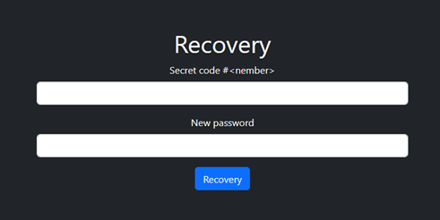

# Wallet

## Description

The wallet service is a wallet with candy wrappers in CTF currency. The following features is available on it: registration, authentication, password recovery, transactions to another user or system as a donating. For making transactions and recovering password, it was necessary to use the secret codes that the system generates after your registration.

## Vulnerability

There is a vulnerability in the password recovery workflow. It allows to change the password of any user using your own secret codes. This vulnerability is able because  password recovery is multi-stage, and a PHP’s sessions are used to save the state between stages, in which the user id and secret code id are stored. When the user asks about password reset, the system did not perform any clearing or checking of previously used `$_SESSION`. It makes possible to mix the parameters of different password recovery attempts by replacing the user id in the `$_SESSION`, but leaving the secret code id unchanged. 

To do this, use the following steps:

1. Register the user with <email> and save secret codes
2. Go to the transaction page and get a list of email addresses registered in the system
3. Send a POST request for password recovery endpoint

   

4. Send a POST request with changing the recovery type to a "code"

   

   We’ll receive a form with a "Secret code $<number>" as a response

   
5. Re-send the POST request for password recovery, but with the received `PHPSESSID and` the email of the victim
   
6. Send a POST request with the secret code that the system requested from us at step 4
   
7. Profit. The user <victim_email> now has the password <new_password>
 

